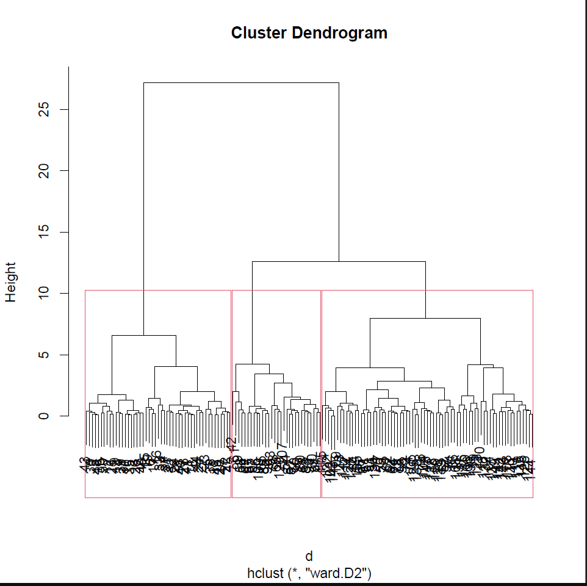

# 🔍 Data Analytics Portfolio

**Michael (Mike) Koutsakis**  
*Data Analyst | ERP Specialist → Power BI & SQL Developer*  
Transforming raw data into actionable insights through advanced analytics and visualization.

---

## 🖼️ Project Showcase

### 1. Hierarchical Cluster Analysis (R)
  
**Techniques Used**:  
- Ward.D2 clustering algorithm  
- Dendrogram visualization  
- Customer segmentation  

*Perfect for:* Market basket analysis and customer grouping  

---

### 2. Demographic Dashboard (Power BI)
  
**Key Features**:  
- Interactive map with UN population metrics  
- Waterfall charts for demographic trends  
- Tooltip-driven storytelling  

*Ideal for:* Public health and policy decision-making  

---

### 3. Predictive Modeling Workflow (KNIME)
  
**Components**:  
- CSV data ingestion  
- Regression tree modeling  
- Numeric performance scoring  

*Applied to:* Sales forecasting and inventory optimization  

---

### 4. Advanced Data Visualization (R/Python)
  
**Capabilities Demonstrated**:  
- Multi-variable plotting  
- Trend line analysis  
- Anomaly detection  

---

## 🛠️ Technical Stack

---

## 📬 Let's Connect

*Open to collaborations and data challenges!*
